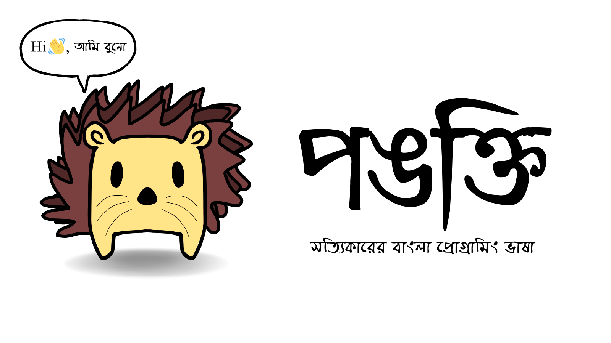

# The Pankti Programming Language
#### Interpreter & Bytecode Compiler written in C  

## Introduction
Pankti is an interpreted dynamically typed programming language for programming 
in Bengali, English as well as Combination of both. Pankti is an easy to learn
programming language but it was also powerful language to create useful and fast
programs.

## Project Status
> Pre-alpha. Under heavy development

LICENSE : GPL v3

Buno the Hedgehog, and all artworks are copyrighted to Me, Palash Bauri, all 
rights are reserved for the Buno the Hedgehog images.
